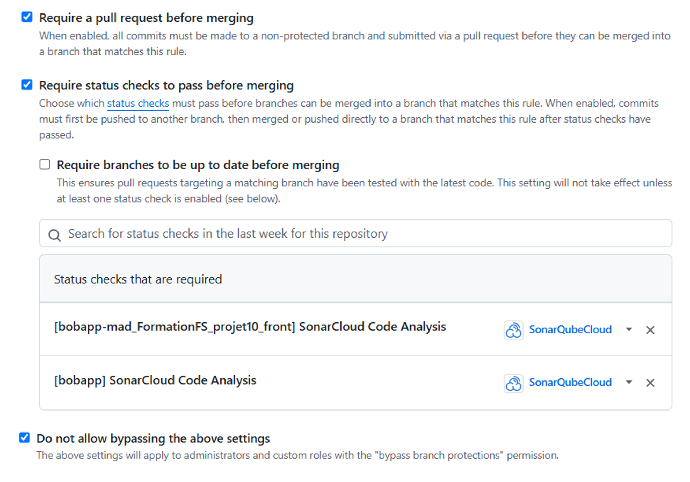
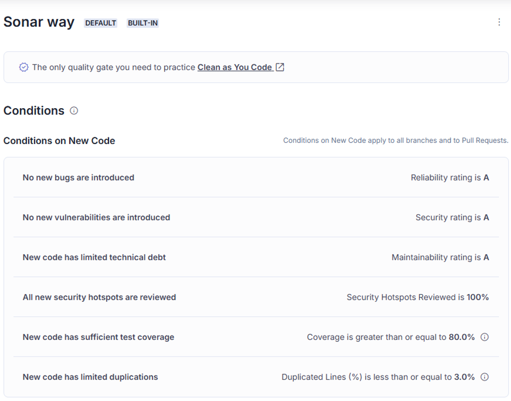
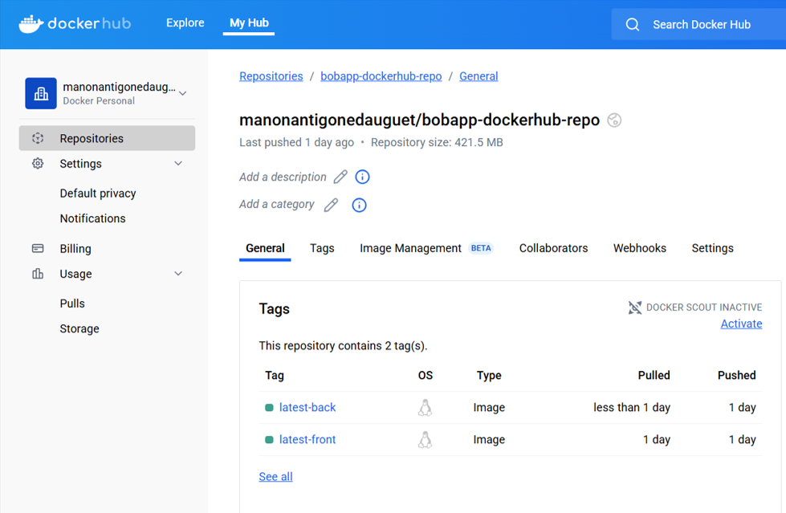
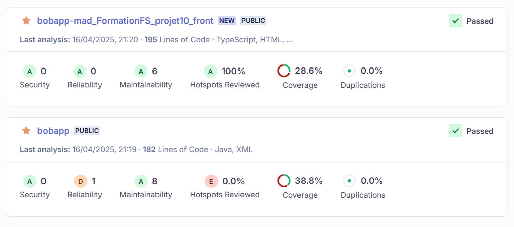
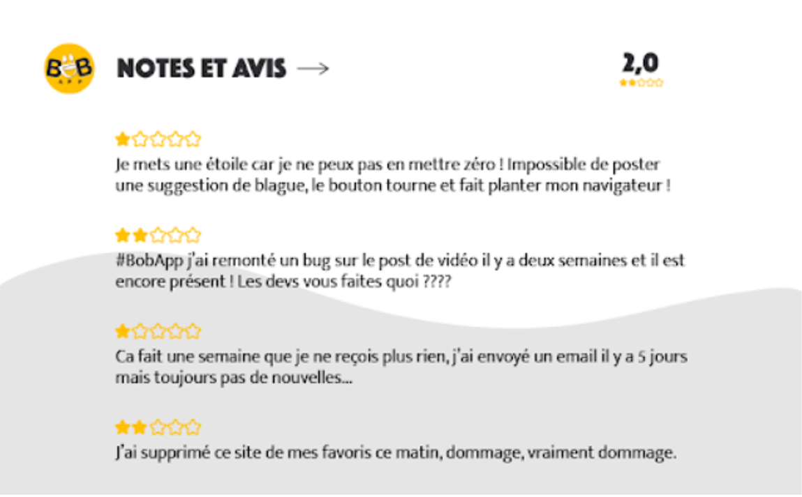

# BobApp

L'application de joke par excellence !

# Table des matières
 - [1 - Installation du projet](#1---installation-du-projet)
    - [1.1 - Côté front-end](#11---front-end)
    - [1.2 - Côté back-end](#12---back-end)
 - [2 - Mise en place de la CI/CD](#2---ci--cd)
    - [2.1 - Définitions](#21---définitions)
    - [2.2 - Règles CI/CD de BobApp](#22---règles-cicd-de-bobapp)
    - [2.3 - Détails des settings](#23---détails-des-settings)
 - [3 - Détails des worflows](#3---détails-des-worflows)
    - [3.1 - Général](#31---général)
    - [3.2 - CI Front](#32---ci-front--tests-build-et-analyses)
    - [3.3 - CI Back](#33---ci-back--tests-build-et-analyses)
    - [3.4 - CD](#34---cd--déploiements-docker)
 - [4 - Métriques initiales](#4---métrique-initiales)
    - [4.1 - Analyse Sonar](#41---analyse-sonar)
    - [4.2 - Notes et avis](#42---notes-et-avis)

 

# 1 - Installation du projet
## 1.1 - Front-end 

- `cd front` : aller dans le dossier front
- `npm install` : installer les dépendances
- `npm run start` : lancer l'application front

**Docker**

- `docker build -t bobapp-front .` : build le container
- `docker run -p 4200:4200 --name bobapp-front -d bobapp-front` : démarre le container

## 1.2 - Back-end

- `cd back` : aller dans le dossier back
- `mvn clean install` : installer les dépendances
- `mvn spring-boot:run` : lancer l'application back
- `mvn test` : lancer les tests

**Docker**

- `docker build -t bobapp-back .` : build le container
- `docker run -p 8080:8080 --name bobapp-back -d bobapp-back ` : démarre le container

 

# 2 - CI / CD
## 2.1 - Définitions

 - **GitHub Actions** est une plateforme permettant la mise en place d'une **démarche CI/CD** ("Intégration Continue / Déploiement Continu").  
Son fonctionnement repose sur des **"worflows"**, des fichiers YAML stockés dans le dossier `.github/worklows`.  

 - Une **"pipeline"** est la suite des étapes d'une démarche CI/CD, pouvant inclure différents "worflows". Elle va du commit au déploiement.

 - La **CI ("Intégration Continue")**  vise à faciliter le travail collaboratif sur un dépôt de code partagé, en automatisant des vérifications de code à chaque mise à jour du code.  
Elle inclue l'exécution automatique et d’intégration, ainsi que d'éventuelles analyses de qualité, afin de détecter rapidement d’éventuelles régressions.

 - La **CD ("Déploiement Continu")** vise à automatiser la mise en production de nouvelles versions d’une application. Elle s’appuie sur l'intégration continue et permet de livrer rapidement un code testé, validé et déployable.

## 2.2 - Règles CI/CD de BobApp

Pipeline BobApp :  
- Lors d'un push ou d'un pull-request sur `main`ou `develop`, les worflows `ci-front.yml` et `ci-back.yml` s'enclenchent :
   - Les dépendances du projet sont ajoutées.
   - Les tests sont lancés et le taux de couverture est généré. 
   - Si les tests échouent, alors le job en cours s'arrête et l'analyse sonar n'est pas lancée.  
   - L’analyse Sonar est déclenchée uniquement si les tests sont passés avec succès.  
   - La step d'analyse sonar inclue les variables nécessaires à la connexion à SonarCloud et aux deux projets (front et back) du monorepo.
- La fusion d’une pull request vers `main` n'est autorisée que si une analyse sonar est lancée, réussie, et si elle renvoie à GitHub un status de validation (un "status checks"), ceci à la fois pour le projet front et le projet back.
- Lorsqu'une pull request sur `main` est validée et fusionnée, le worflows `cd.yml` s'enclenche :
   - Les images Docker du front et du back sont constuite et déployées.   
   - Cette étape repose sur les Dockerfile situés (généralement) dans les dossiers `./front` et `./back`.
   - La step de login inclue les variables nécessaires à la connexion à Docker Hub.

Ainsi, le nouveau code est analysé. S'il est valide, il peut être ajouté à la branche `main`du projet. Seul un code propre et validé peut être déployé.

## 2.3 - Détails des settings

### Environnement

La connexion à SonarCloud et Docker Hub est permise par des identifiants, renseignées dans les commandes des workflows. Ces identifiants ne doivent pas être ajoutés en dur mais protégés par des variables.  
Dans la partie "Settings" de GitHub, un environnement "bobapp" est créé pour contenir ces secrets. Cet environnement est spécifié dans les worflows pour que les secrets soit retrouvés.

### Protection de branche

La branche `main` est protégée. Les règles de protection de la branche sont ajoutées sur GitHub, dans la partie "Branches" des "Settings" du projet, telle qu'illsutrée ci-après.  

Avant de pouvoir merger dans `main`, une pull-request est nécessaire, et un "status checks" postitif est requis. Ces status checks sont renvoyés par SonarQubeCloud après analyse, et les "status checks" de notre projet sont spécifiés dans les settings.  
Il n'est pas possible de bypass ces règles.

### Analyse Sonar

La CI/CD de BobApp repose entre autres sur Sonar Cloud. Du fait d'être sur la version gratuite, nous utilisons la "Quality Gate" par défaut de SonarCloud : **"Sonar Way"**.

 - **Mise en place** :  
 
Pour mettre en place ce setting, la première étape est de créer un compte Sonar sur [SonarCloud](https://sonarcloud.io/) et de le relier au compte GitHub.  
Ensuite créez une "organisation". "Analyse new project" pour ajouter un nouveau projet. Parmis ceux proposés vous retrouver celui de votre compte GitHub. ⚠ : mettre en place un **"mono-repo"** pour autoriser à avoir deux projets (un back et un front) sur le même repository GitHub.  
Lors que vous vous rendrez sur vos nouveaux projets, dans "Informations" vous retrouverez son **« Project Key »** et son **« Organisation Key »**, à renseigner dans le worflows lors du lancement de l'analyse.  
Dans "Administration" vous aurez accès à l'onglet **"Quality Gate"** où vous pourrez définir et choisir une « Quality Gate ». Elle évalue le projet sur un certaines nombre de critères . En définissant ces critères dans SonarCloud via l'interface web, ces règles s'appliquent à toutes les analyses effectuées par tous les développeurs qui travailleront sur le projet.  
⚠ la première analyse de Sonar se fait sur l'ensemble du code et ne ne doit pas bloquer le merge sur `main`. Sonar évalue le projet sur les différents Kpi, puis, sur les prochaines analyses, seul le nouveau code est évalué et soumis aux seuils des Kpi détaillés ci-après.

Dans les settings de GitHub, ajouter une protection via sur la base des "status checks" renvoyés par les analyses Sonar sur chacun des deux projet Sonar ([voir la partie Protection de branche](#protection-de-branche)).

 - **SONAR_TOKEN** : 
 
Dans l'onglet "Sécurité" de SonarCloud vous pourrez générer un token. Copiez-le et ajoutez-le à votre environnement GitHub ([voir la partie Environnement](#environnement)).
Ce token sera à renseigner dans le worflows lors du lancement de l'analyse pour permettre la connexion à SonarCloud.

 - **Kpi de Sonar Way**

Les Kpi sont des critères de qualité permettant d'éviter toute régression. Chacun est associé à un seuil que le nouveau code doit atteindre.
Ces critères s'appliquent sur le nouveau code uniquement.

**No new bugs are introduced --> Reliability** : le nouveau code ne doit pas contenir de bugs (détectés par Sonar).   
<u>Exemple</u> : une exception non gérée.
    
**No new vulnerabilities are introduced --> Security** : aucune faille de sécurité ne doit être ajoutée dans le nouveau code.  
<u>Exemple</u> : une utilisation de version de librairies vulnérable, ou des injection SQL possibles.  

**New code has limited technical debt --> Maintenabiliy** : le nouveau code ne doit pas introduire trop de dette technique, encourageant à un code propre et maintenable. Concrètement cela signifie que le projet reste facile à comprendre, modifier et étendre, donc à maintenir.   
<u>Exemple</u> : de multiples "code smells", des fonctions trop longues et non commentées.  
Les **"code smells"** sont des mauvaises pratiques de code n'entraînant pas de bugs directs mais sources de potentielles problèmes de fiabilité ou de maintenabilité.

**All security hotspots reviewed	Hotspots --> Security Hotspots**: certaines fonctionnalités potentiellement critiques doivent être validées manuellement sur SonarCloud pour que la "Quality Gate" soit passée. Cela concerne des endroits du code qui ne sont pas nécessairement une faille, mais qui méritent une revue humaine parce qu’ils touchent à des éléments sensibles de sécurité(accès aux fichiers, requêtes sql, la gestion des authentification...).

**New code has sufficient test coverage** :  le nouveau code doit être couvert à au moins 80 % par des tests. Plus un code est testé, plus il est protégé de comportements inattendus et autres régressions, mais un pourcentage supérieur serait superflu.

**New code has limited duplications** : il ne doit pas y avoir plus de 3 % de lignes dupliquées dans le nouveau code. Un code duppliqué est difficile à maintenir, et un code bien factorisé est souvent gage de qualité.

###  Docker

L'étape CD consiste à créer un nouveau conteneur pour le front et un nouveau pour le back, avec le code mis à jour, puis les déployer en ligne sur DockerHub.

 - **Mise en place**

Pour utiliser DockerHUb, créez un compte sur [DockerHub](https://hub.docker.com/). Créez ensuite un repository qui contiendra le projet back et front à la fois : il s'agit de l'espace de stockage de DockerHub, où les images sont créées et mises à jour.  
Les **"tags"** permettent d'identifier les deux projets (front et back) et sont à spécifiés dans le worflows de cd. Lors du premier run de l'étape, l'image avec le tag précisé est créee. Les fois suivantes l'image identifiée est mise à jour.

 - **DOCKERHUB_USERNAME et DOCKERHUB_TOKEN**

Allez sur la partie compte de DockerHub : le "DOCKERHUB_USERNAME" correspond à votre nom d'utilisateur sur DockerHUb.  
Dans l'onglet "Account settings" puis "personnal access tokens" de SonarCloud vous pourrez générer un token. ⚠ : créez-le avec les permissions "read"(permettre l'accès aux images) et "write" (pour pousser les nouvelles images).  
Ajoutez ces deux variables à votre environnement GitHub ([voir la partie Environnement](#environnement)). Ces variables seront à renseigner dans le worflows de cd pour permettre la connexion à DockerHub'.

 

# 3 - Détails des worflows

## 3.1 - Général

 - Dans chacun des worflows on commence par nommer l'action et préciser les décelencheurs ([rappel des déclencheurs](#22---règles-cicd-de-bobapp)).  
On défini ensuite un job (exemple : "back"), son nom (exemple : "Build and test back app"), puis ses différents "steps".

- L'environnement GitHub ("bobapp") est précisé pour que les variables et secrets utilisés soit retrouvés ([voir partie Environnement](#environnement)).

- `runs-on: ubuntu-latest` indique que les étapes du job seront exécutées dans un environnement Linux (Ubuntu) propre, hébergé par GitHub Actions.

- Dans les worflows de CI 
   - la branche par défaut ("working-directory") est spécifiée pour préciser le répertoire dans lequel la step s’éxécute (`./back`ou `./front`).
   - `actions/checkout@v2` récupère le code source du dépôt GitHub dans le workflow.

## 3.2 - CI Front : tests, build et analyses

 - `actions/setup-node@v2`:

Installe Node.js sur l'environnement d'exécution. Cela autorise les commandes `npm`suivantes.

 - `npm install -g @angular/cli` :

Installe Angular CLI sur l'environnement d'exécution. Cela autorise la commande `ng test`.

 - `npm install` :

Installe les dépendances pour exécuter les tests.

 - `ng test --watch=false --code-coverage` :

Lance les tests (mode non interactif) et génère le rapport de coverage.  
L'analyse Sonar requiert un fichier de rapport de couverture de test en `.lcov` (et non en `html` comme dans la configuration initiale). Afin qu'il soit généré, `{ type: 'lcov' }` est ajoutés aux "coverageReporter" dans [la configuration karma](./front/karma.conf.js).

Remarque : les tests entrent en erreur lorsqu'ils sont lancés avec Chrome dans un environnement sans interface graphique, comme dans le cadre des GitHub Actions.  
Dans [la configuration karma](./front/karma.conf.js) on précise donc l'utilisation de "ChromeHeadless" (ne requierant pas d'interface graphique) lors des tests lorsque nous sommes dans un environnemnt CI.

 - `sonarsource/sonarqube-scan-action@v5` :

Lance l’analyse sonar.  
La commande doit être complétée pour y spécifier la clef d’organisation, du projet, le token ([voir partie Sonar des Settings](#23---détails-des-settings)) et l'emplacement du fichier de de rapport de coverage.

Remarque : on spécifie `sonar.sources=front/src` dans les arguments pour spécifier le contexte à SonarCloud (différent du "working-directory" utilisé par GitHub Actions).

## 3.3 - CI Back : tests, build et analyses

 - `actions/setup-java@v3` :

Installe et configure Java Development Kit (JDK) version 17. La distribution utilisée est temurin, une distribution open-source du JDK.

 - `mvn clean verify` :
 
Compile le code avant de lancer les tests.  
Cette étape permet de vérifier que le code compile bien et permet de lancer les tests et de générer le fichier rapport de coverage `jacoco.xml` dans le dossier `./target/site/jacoco`.

 - `phoenix-actions/test-reporting@v8` : 

Génère un rapport visuel accessible sur l'action sur GitHub Actions.

 - `mvn sonar:sonar` :

Le plugin sonar a été installé sur le projet back.  
La commande permet de lancer l’analyse et doit être complétée pour y spécifier la clef d’organisation, du projet, le token ([voir partie Sonar des Settings](#23---détails-des-settings)) et l'emplacement du fichier de de rapport de coverage.

## 3.4 - CD : déploiements Docker

 - `docker/login-action@v3`:
 
Authentifie le worflows auprès de DockerHub avec les identifiants du compte Docker.  

 - `docker/setup-qemu-action@v3` :
 
Installe "QEMU", un outil d'exécuter des logiciels conçus pour une architecture matérielle spécifique sur une autre plateforme, généralement d'architecture différente. C'est une étape recommandée pour garantir que les images Docker peuvent être exécutées sur des plateformes diverses.  

 - `docker/setup-buildx-action@v3`:
 
Initialise Buildx, l’outil de build avancé de Docker, qui permet notemment le push direct vers un registre (comme ici). 

 - `docker/build-push-action@v6` :
 
Construit l'image Docker. Cette étape est répétée pour le front et le back, en spécifiant à chaque fois :
- le contexte à Docker, `./back`ou `./front` (car différent du "working-directory" utilisé par GitHub Actions).
- `push: true` pour un push automatique de l'image.
- le tag spécific et different entre front et back, et incluant le nom du repository ([voir partie Docker des Settings](#23---détails-des-settings)).

 

# 4 - Métrique initiales

## 4.1 - Analyse Sonar

Ci-dessous les résultats de l'analyse Sonar sur le projet côté front et côté back.

### Projet front

 - **Sécurity = 0, score A :** pas de failles de sécurité.  
 - **Reliability =0, score A :** pas de bugs détectés.  
 - **Maintenability = 6 open issues, score A :** quelques code smells détectés, comme le besoin de préciser « readonly » sur les variables non réassignées, mais rien de majeur.   
 - **Accepted Issues = 0 :** il n’y a pas de « problèmes acceptés ».  
 Dans SonarCloud il existe une possibilité de spécifier que des éléments de code détectés comme bugs, ou vulnérabilité par Sonar n’en sont pas. Ces règles de « faux positifs » sont listées dans cette partie, actuellement vide.
 - **Coverage = 28.6 % :** le code actuel est couvert à 28.6%. Lorsqu’un nouveau code est ajouté, ce nouveau code doit être couvert à 80% minimum pour passer la Gate Way. Conséquence de quoi, ce pourcentage ne devrait qu’augmenter au fur et à mesure des développements.
 - **Duplications = 0.0% :** pas de duplication de code détecté.

### Projet back

 - **Sécurity = 0, score A :** pas de failles de sécurité.  
 - **Reliability = 1, score B :** un bug potentiel est détecté sur le service [JokeService](./back/src/main/java/com/openclassrooms/bobapp/service/JokeService.java) côté back, où Random ne devrait pas être instancié dans une méthode mais stocké en propriété du service. Si ce service, tel quel, était ajouté en nouveau code, l'analyse aurait bloqué la PR.
 - **Maintenability = 8 open issues, score A :** quelques code smells détectés mais rien de majeur.   
 - **Accepted Issues = 0 :** il n’y a pas de « problèmes acceptés ».  
 Dans SonarCloud il existe une possibilité de spécifier que des éléments de code détectés comme bugs, ou vulnérabilité par Sonar n’en sont pas. Ces règles de « faux positifs » sont listées dans cette partie, actuellement vide.
 - **Coverage = 38.8 % :** le code actuel est couvert à 38.8%. Lorsqu’un nouveau code est ajouté, ce nouveau code doit être couvert à 80% minimum pour passer la Gate Way. Conséquence de quoi, ce pourcentage ne devrait qu’augmenter au fur et à mesure des développements.
 - **Duplications = 0.0% :** pas de duplication de code détecté.

## 4.2 - “Notes et avis”

Selon les avis rapportés ci-dessus, il semblerait qu'il y ait des bugs sur la fonctionnalité de suggestion de blagues, notemment sous forme de vidéo.  
Conséquence de quoi, il n'y a plus de blagues d'affichées au utilisateurs.

La priorité sera donc de réparer cette fonctionnalité clef.

Les utilisateurs rapportent leur frustration sur la latence d'arrivée de patchs correctifs. Je pense qu'avec la mise en place de notre démarche CI/CD aidera sur ce point.   
Les développeurs pourront participer de façon plus confortable (moins de craintes d'apporter des regressions, règles de commit plus claires...), le code proposé sera automatiquement vérifié et les nouvelles versions automatiquement déployées.